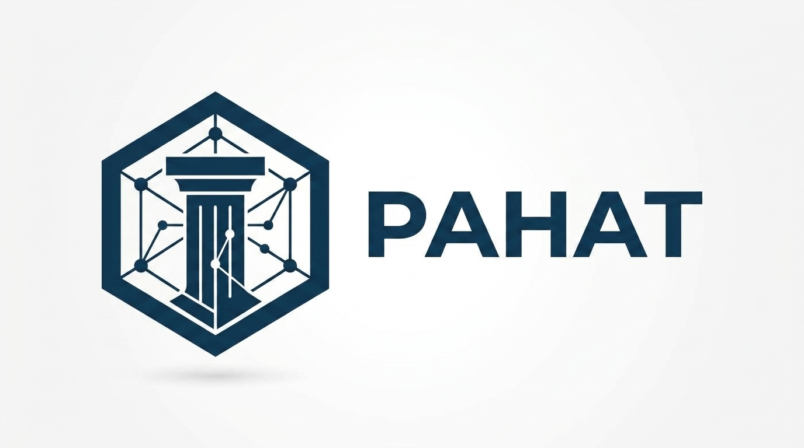

<p align="center">
  
</p>


# 🚀 PAHAT Programming Language — Documentation Guide

**PAHAT (Pemrograman Analitis Berbasis Heuristik dan Arsitektur Terpadu)** adalah bahasa pemrograman berkonsep **expressive & lightweight** dengan sintaks intuitif berbasis bahasa Indonesia.

---

# 👨‍💻 Tentang PAHAT

**PAHAT (Pemrograman Analitis Berbasis Heuristik dan Arsitektur Terpadu)** dibuat oleh **Syahdan Masyhuri** sebagai bahasa pemrograman yang berfokus pada kesederhanaan sintaks, keterbacaan, dan pengalaman pemrograman yang dekat dengan bahasa Indonesia.

PAHAT berusaha menghadirkan pengalaman pemrograman yang **ringan, ekspresif, dan mudah dipahami**, tanpa menghilangkan konsep-konsep fundamental dalam pemrograman seperti variabel, operator, kontrol alur, fungsi, struktur data, JSON, dan modul.

Bahasa ini dibuat dengan tujuan menghadirkan pendekatan alternatif dalam mempelajari dan menggunakan bahasa pemrograman melalui sintaks yang lebih familiar bagi pengguna bahasa Indonesia.

> **PAHAT — sederhana untuk dibaca, ringan untuk digunakan.** 🚀
> 
> 

**Dibuat dengan ❤️ oleh Syahdan Masyhuri.**

---

# 📌 Metadata

| Properti | Nilai |
| --- | --- |
| **Nama** | PAHAT Programming Language |
| **Kepanjangan** | Pemrograman Analitis Berbasis Heuristik dan Arsitektur Terpadu |
| **Pembuat** | Syahdan Masyhuri |
| **Versi** | 1.0.0 |
| **Status** | Development |
| **Ekstensi File** | `.pahat` |
| **Bahasa Sintaks** | Bahasa Indonesia |
| **Paradigma** | Prosedural, Imperatif, Fungsional |
| **Lisensi** | MIT |
| **Dokumentasi** | `README.md` |

---

# 📖 Daftar Isi

* [Metadata](#-metadata)
* [Tentang PAHAT](#-tentang-pahat)
* [Variabel](#-variabel)
* [Tipe Data](#-tipe-data)
* [Operator](#-operator)
* [Input dan Output](#-input-dan-output)
* [Percabangan](#-percabangan)
* [Perulangan](#-perulangan)
* [Pilihan Kondisi (Switch Case)](#-pilihan-kondisi-switch-case)
* [Array](#-array)
* [Object](#-object)
* [JSON](#-json)
* [Fungsi](#-fungsi)
* [Modul](#-modul)
* [Komentar](#-komentar)
* [Contoh Program Lengkap](#-contoh-program-lengkap)
* [Ringkasan Fitur](#-ringkasan-fitur)

---

# 🔤 Variabel

PAHAT menggunakan sintaks sederhana untuk membuat variabel dengan operator penugasan `=`[cite: 1, 2]. Penulisan baris dieksekusi dengan diakhiri tanda titik koma `;`[cite: 1, 2].

```pahat
nama = "Syahdan";
umur = 20;
tinggi = 170.5;
aktif = true;

```

PAHAT menggunakan penetapan tipe data secara dinamis berdasarkan nilai yang diberikan.

Contoh:

```pahat
angka = 10;
angka = "sepuluh";

```

Variabel dapat berubah tipe selama program berjalan.

---

# 🧩 Tipe Data

PAHAT mendukung beberapa tipe data dasar:

## INTEGER

Bilangan bulat (mencakup angka `0-9`)[cite: 1, 2].

```pahat
umur = 20;
jumlah = 100;

```

## FLOAT

Bilangan desimal yang dipisahkan tanda titik `.`[cite: 1, 2].

```pahat
tinggi = 170.5;
nilai = 98.75;

```

## STRING

Teks menggunakan tanda kutip ganda (`"..."`) atau kutip tunggal (`'...'`)[cite: 1, 2]. Mendukung *escape sequence* seperti `\n`, `\t`, `\r`, `\"`, dan `\'`[cite: 2].

```pahat
nama = "Syahdan";
pesan = 'Halo Dunia!';

```

## BOOLEAN

Nilai logika menggunakan kata kunci literal[cite: 1, 2]:

* `true` / `benar` (bernilai true)[cite: 1, 2]
* `false` / `salah` (bernilai false)[cite: 1, 2]

```pahat
aktif = true;
selesai = false;

```

## NULL

PAHAT menggunakan `nol` sebagai representasi nilai kosong[cite: 1, 2].

```pahat
data = nol;

```

---

# 🧮 Operator

## Operator Aritmatika

| Operator | Fungsi | Contoh |
| --- | --- | --- |
| `+` | Penjumlahan | `a + b` |
| `-` | Pengurangan / Unary Minus | `a - b`, `-a` |
| `*` | Perkalian | `a * b` |
| `/` | Pembagian | `a / b` |
| `%` | Modulo (Sisa Bagi) | `a % b` |
| `**` | Pangkat (Exponentiation) | `a ** b` |

[cite: 1, 2]

Contoh:

```pahat
a = 10;
b = 3;

cetak(a + b);   // 13
cetak(a - b);   // 7
cetak(a * b);   // 30
cetak(a / b);   // 3.333...
cetak(a % b);   // 1
cetak(a ** b);  // 1000

```

## Operator Perbandingan

| Operator | Fungsi |
| --- | --- |
| `==` | Sama dengan |
| `!=` | Tidak sama dengan |
| `<` | Lebih kecil |
| `>` | Lebih besar |
| `<=` | Lebih kecil atau sama |
| `>=` | Lebih besar atau sama |

[cite: 1, 2]

Contoh:

```pahat
umur = 20;

cetak(umur == 20);
cetak(umur > 18);
cetak(umur < 30);

```

## Operator Logika

| Operator | Fungsi |
| --- | --- |
| `&&` | AND |
| `||` | OR |
| `^` | XOR |
| `!` | NOT (Negasi) |

[cite: 1, 2]

Contoh:

```pahat
a = true;
b = false;

cetak(a && b);
cetak(a || b);
cetak(a ^ b);
cetak(!a);

```

## Increment dan Decrement

PAHAT mendukung increment (`++`) dan decrement (`--`)[cite: 1, 2]:

```pahat
angka = 10;

angka++;
cetak(angka); // 11

angka--;
cetak(angka); // 10

```

---

# 🖨️ Input dan Output

Untuk menampilkan nilai ke layar digunakan fungsi `cetak()`[cite: 1, 2].

```pahat
cetak("Halo Dunia!");
cetak(10);
cetak(10 + 20);

```

---

# 🔀 Percabangan

PAHAT menggunakan kata kunci `jika` untuk mengevaluasi kondisi dan `lainnya` untuk alternatif kondisi[cite: 1, 2].

```pahat
umur = 20;

jika (umur >= 18) {
    cetak("Dewasa");
} lainnya {
    cetak("Belum dewasa");
}

```

Dukungan bercabang dengan `lainnya jika`:

```pahat
nilai = 85;

jika (nilai >= 90) {
    cetak("A");
} lainnya jika (nilai >= 80) {
    cetak("B");
} lainnya {
    cetak("C");
}

```

---

# 🔁 Perulangan

## `selama`

Perulangan berbasis kondisi (mirip `while`)[cite: 1, 2].

```pahat
angka = 1;

selama (angka <= 5) {
    cetak(angka);
    angka++;
}

```

## `ulang`

Perulangan berbasis iterasi terstruktur (mirip `for`)[cite: 1, 2].

```pahat
ulang (i = 0; i <= 4; i++) {
    cetak("Halo PAHAT!");
}

```

## Hentikan Iterasi (`hentikan`)

Gunakan kata kunci `hentikan` untuk menghentikan perulangan secara paksa (mirip `break`)[cite: 2].

```pahat
ulang (i = 1; i <= 10; i++) {
    jika (i == 5) {
        hentikan;
    }
    cetak(i);
}

```

---

# 🔀 Pilihan Kondisi (Switch Case)

PAHAT mendukung struktur kontrol keputusan menggunakan kata kunci `pilih`, `kasus`, dan `bawaan`[cite: 2].

```pahat
pilihan = 2;

pilih (pilihan) {
    kasus 1: {
        cetak("Pilihan pertama");
    }
    kasus 2: {
        cetak("Pilihan kedua");
    }
    bawaan: {
        cetak("Pilihan tidak ditemukan");
    }
}

```

---

# 📦 Array

Array di PAHAT didefinisikan menggunakan kurung siku `[...]`[cite: 1, 2]. Elemen diakses berdasarkan indeks berbasis 0[cite: 1, 2].

```pahat
angka = [10, 20, 30, 40, 50];

cetak(angka[0]); // 10
cetak(angka[2]); // 30

```

Array dapat berisi tipe data campuran, bertingkat (nested array), hingga multi-dimensi:

```pahat
matrix = [
    [1, 2, 3],
    [4, 5, 6]
];

cetak(matrix[0][1]); // 2

```

---

# 🗂️ Object

PAHAT mendukung **object literal** untuk menyimpan pasang *key-value* menggunakan kurung kurawal `{...}`[cite: 1, 2]. *Key* berupa identifier atau string[cite: 2].

```pahat
pengguna = {
    nama: "Syahdan",
    umur: 20,
    aktif: true
};

```

Nilai object dapat diakses menggunakan **notasi bracket** (`["key"]`) maupun **notasi titik** (`.key`)[cite: 1, 2]:

```pahat
cetak(pengguna["nama"]);
cetak(pengguna.umur);

```

Pengubahan/Penetapan properti object:

```pahat
pengguna.umur = 21;
pengguna["aktif"] = false;

```

---

# 🧾 JSON

PAHAT memiliki modul bawaan standar untuk pengolahan JSON[cite: 1, 2]:

* `baca_json(string_json)` — Mengubah string JSON menjadi objek/array PAHAT.


* `tulis_json(data)` — Mengubah objek/array PAHAT menjadi string JSON.


```pahat
// Konversi String JSON ke Objek PAHAT
data = baca_json("{\"nama\":\"Syahdan\",\"umur\":20}");
cetak(data.nama);

// Konversi Objek PAHAT ke String JSON
pengguna = {
    nama: "Syahdan",
    aktif: true
};
json_str = tulis_json(pengguna);
cetak(json_str);

```

---

# ⚙️ Fungsi

Fungsi dideklarasikan menggunakan kata kunci `fungsi`[cite: 1, 2]. Nilai dapat dikembalikan menggunakan kata kunci `kembalikan`[cite: 1, 2].

```pahat
fungsi tambah(a, b) {
    kembalikan a + b;
}

hasil = tambah(10, 20);
cetak(hasil); // 30

```

---

# 📦 Modul

PAHAT mendukung modularisasi kode dengan membagi berkas ke dalam ekstensi `.pahat`[cite: 1, 2].

## Mengimpor Modul

Gunakan kata kunci `impor` diikuti dengan nama berkas/modul (tanpa ekstensi)[cite: 1, 2]:

```pahat
impor matematika;

```

Pemanggilan fungsi dari modul menggunakan format `nama_modul.nama_fungsi()`[cite: 1, 2]:

```pahat
hasil = matematika.tambah(10, 20);
cetak(hasil);

```

---

# 💬 Komentar

PAHAT mendukung dua gaya penulisan komentar[cite: 1, 2]:

```pahat
// Komentar satu baris

/*
   Komentar
   multi-baris
*/

```

---

# 🧪 Contoh Program Lengkap

```pahat
impor matematika;

// Deklarasi Objek
pengguna = {
    nama: "Syahdan",
    umur: 20,
    aktif: true,
    nilai: [80, 90, 95]
};

// Evaluasi Kondisi
jika (pengguna.umur >= 18 && pengguna.aktif) {
    cetak("Pengguna aktif dan sudah dewasa");
} lainnya {
    cetak("Pengguna tidak memenuhi syarat");
}

// Operasi Modul
total_nilai = matematika.tambah(pengguna.nilai[0], pengguna.nilai[1]);
cetak(total_nilai);

// Pilihan Kondisi
pilih (pengguna.umur) {
    kasus 20: {
        cetak("Berumur tepat 20 tahun");
    }
    bawaan: {
        cetak("Umur lainnya");
    }
}

// Pemrosesan JSON
json_data = tulis_json(pengguna);
cetak(json_data);

```

---

# 📋 Ringkasan Fitur

| Fitur | Sintaks PAHAT |
| --- | --- |
| Variabel | `nama = "Syahdan";` |
| Output | `cetak("Teks");` |
| Boolean | `true` / `benar`, `false` / `salah` |
| Null | `nol` |
| Operator Pangkat | `a ** b` |
| Percabangan | `jika`, `lainnya jika`, `lainnya` |
| Perulangan | `selama (...)`, `ulang (...)` |
| Kontrol Perulangan | `hentikan;` |
| Multi Kondisi | `pilih`, `kasus`, `bawaan` |
| Akses Properti Object | `obj["key"]` atau `obj.key` |
| Pengembalian Fungsi | `kembalikan` |
| Impor Modul | `impor nama_modul;` |
| Panggilan Fungsi Modul | `nama_modul.fungsi()` |

---

# 📜 Lisensi

PAHAT menggunakan lisensi **MIT**.

---

# 🚀 PAHAT

**Pemrograman Analitis Berbasis Heuristik dan Arsitektur Terpadu**

> **Sederhana untuk dibaca, ringan untuk digunakan.**
> 
> **Dibuat oleh Syahdan Masyhuri.**
>